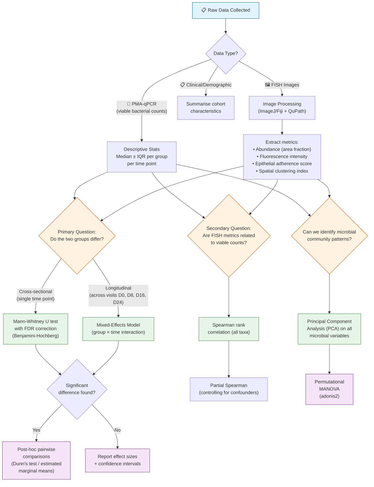

# Improved Statistical Analysis Plan
## For: Multiplex FISH Analysis of Post-Treatment Vaginal Microbial Colonization in BV

**Author note:** This document was written as an improved replacement for the original
Section 6 (Statistical Analysis) of the Masters proposal by T.N. Mahlangu. Each
method is explained in plain language, followed by *why* it was chosen.

---

## 1. Overview

The study generates **three types of data**, each needing its own statistical approach:

| Data Type | Source | What It Measures |
|---|---|---|
| **Image-based (FISH)** | Fluorescence microscopy | Bacterial abundance, fluorescence intensity, epithelial adherence, spatial organization |
| **Quantitative (PMA-qPCR)** | Viable bacterial counts | How many live bacteria of each species are present |
| **Clinical / demographic** | CAPRISA 098 cohort data | Age, Nugent score, STI status, contraceptive use, etc. |

These are **not independent** — for example, FISH spatial metrics at day 8 might predict
PMA-qPCR counts at day 16. The statistical plan below treats them together.

---

## 2. Statistical Flow Diagram



---

## 3. Detailed Methods — Explained and Justified

### 3.1 Sample Size Justification (NEW — missing from original proposal)

**What to do:**
Conduct an *a priori* power analysis using pilot data or published studies (e.g., Hardy
et al., 2015; Swidsinski et al., 2024). For a Mann-Whitney U test comparing two groups
(antibiotic-responsive vs antibiotic-resistant) with medium effect size (Cohen's d = 0.6),
α = 0.05, and power = 0.80, a minimum of **~20 participants per group** is needed
(calculated using G\*Power or the `pwr` package in R).

**Why it was missing:**
The original proposal mentions no sample size calculation. Reviewers will want to know
the study can detect a meaningful difference.

**Why this method:**
A power analysis tells you how many samples you need to avoid a *false negative*
(missing a real difference because you didn't have enough data).

---

### 3.2 Descriptive Statistics (expanded from the original)

**What to do:**
For every variable (each bacterial taxon, each FISH metric, each time point), report:
- **Median and interquartile range (IQR)** — not mean and SD
- **Minimum and maximum**
- **Number of observations** (especially important if there is missing data)

**Why these:**
Microbial count data is almost never normally distributed — it's typically zero-inflated
and right-skewed. Medians and IQRs are robust to outliers.

---

### 3.3 Primary Analysis — Comparing Groups (improved)

#### 3.3.1 Cross-sectional comparisons (at a single visit)

**Original:** Mann-Whitney U test, no correction for multiple testing.

**Improved version:**
1. Perform **Mann-Whitney U tests** for each bacterial taxon and each FISH metric at
   each time point.
2. **BUT** — apply a **Benjamini-Hochberg False Discovery Rate (FDR) correction** to
   the resulting p-values.

**Justification:**
With ~7 bacterial targets × 4 time points × several FISH metrics, you could easily run
50+ separate tests. At p < 0.05, you'd expect ~3 false positives by chance alone. The
Benjamini-Hochberg method controls the *proportion* of false discoveries (e.g., only 5%
of the tests you call "significant" are false).

#### 3.3.2 Longitudinal analysis (across visits — NEW)

**What to do:**
Fit a **mixed-effects model** (also called a linear mixed model, LMM) for each outcome:

```
Value ~ Group + Time + Group × Time + (1 | Participant ID)
```

- **Group** = antibiotic-responsive vs resistant (fixed effect)
- **Time** = visit day (categorical: 0, 8, 16, 24)
- **Group × Time** = the interaction — this tests if the *trajectory* differs between groups
- **(1 | Participant ID)** = random intercept — accounts for the fact that repeated
  measurements from the same person are correlated

**Why this is better than the original:**
The original proposal only does a Mann-Whitney U test, which compares the two groups
at *one* time point, ignoring the study's longitudinal design. Mixed models:
- Use all data efficiently (even if someone misses a visit)
- Handle uneven time spacing
- Tell you *when* groups diverge (e.g., "by day 16, the groups are significantly different")

**What if the data violates normality assumptions?**
Use **aligned rank transform** or a **generalised linear mixed model with a negative
binomial distribution** (for count data).

---

### 3.4 Secondary Analysis — Correlations (improved)

**Original:** Spearman's correlation between viable bacterial burden and FISH spatial
parameters.

**Improved version:**
1. **Spearman rank correlation** — as originally proposed (good choice for non-normal data).
2. **Partial Spearman correlation** (NEW) — controlling for potential confounders such
   as age, baseline Nugent score, and contraceptive use.

**Justification:**
A simple correlation between two variables can be misleading if a third variable affects
both. For example, if older women have both higher bacterial loads and more biofilm
adherence, you'd see a spurious correlation. Partial correlation removes the effect of
these confounders.

---

### 3.5 Multivariate Exploration (NEW — entirely absent from the original)

**What to do:**
1. **Principal Component Analysis (PCA):** Take all microbial variables (PMA-qPCR counts
   for each taxon + FISH metrics) and reduce them to a few summary axes. This helps
   visualise whether antibiotic-responsive and antibiotic-resistant samples cluster
   separately.
2. **Permutational MANOVA (adonis2, in the `vegan` R package):** Test whether the
   multivariate microbial community composition differs between groups.

**Why these are needed:**
Microbiome data is inherently multivariate — bacteria don't exist in isolation. If
*Gardnerella* goes down and *Lactobacillus* goes up together, that's a pattern a
univariate test might miss. PCA shows you the big picture; PERMANOVA tests the pattern
statistically.

---

### 3.6 Multiple Comparison Correction (NEW — missing from original)

| Correction Method | When to Use |
|---|---|
| **Benjamini-Hochberg FDR** | For the primary group comparisons (many tests, exploratory context) — recommended |
| **Bonferroni** | Too conservative for 50+ tests; use only for a small set (≤ 5) of pre-specified hypotheses |

**Recommendation:** Use Benjamini-Hochberg FDR throughout. It balances discovery and
rigour.

---

### 3.7 Handling Missing Data (NEW — missing from original)

**Problem:** In longitudinal studies, participants drop out or miss visits (especially in
cohorts of women at risk for BV).

**What to do:**
- Report *why* data is missing (e.g., loss to follow-up, poor sample quality).
- Compare baseline characteristics of those who completed vs those who dropped out.
- Use **mixed-effects models** (which handle missing-at-random data robustly) rather
  than dropping incomplete cases.

**Why this matters:**
If women who dropped out had more severe BV, then analysing only the "completers"
would bias the results. Mixed models give unbiased estimates under the less strict
"missing at random" assumption.

---

### 3.8 Software

| Task | Recommended Software | Why |
|---|---|---|
| Image analysis | ImageJ/Fiji + QuPath | Already proposed — good choices |
| PMA-qPCR analysis | R (v4.3+) with packages: `lme4`, `glmmTMB`, `emmeans` | More flexible than GraphPad Prism for mixed models and custom contrasts |
| Multivariate analysis | R packages: `vegan`, `ggplot2` | Industry standard for microbiome data |
| Power analysis | G\*Power or R package `pwr` | Free, widely accepted |
| Graphs | `ggplot2` (R) or GraphPad Prism | Publication-quality figures |

**Note:** R is recommended over GraphPad Prism alone because Prism has limited support
for mixed-effects models, partial correlations, and multivariate methods. GraphPad can
still be used for the simple Mann-Whitney and Spearman tests if preferred.

---

## 4. Summary of Changes from the Original

| Aspect | Original Proposal | Improved Version | Why Changed |
|---|---|---|---|
| Sample size | Not mentioned | Power analysis described | Essential for ethics & rigour |
| Group comparison | Mann-Whitney U (single test) | Mixed-effects model (longitudinal) + Mann-Whitney with FDR | Uses all time points; corrects for multiple testing |
| Multiple testing | None | Benjamini-Hochberg FDR | Prevents false positives |
| Correlations | Spearman | Spearman + partial Spearman | Controls for confounders |
| Multivariate | None | PCA + PERMANOVA | Captures community-level patterns |
| Missing data | None | Explicit handling described | Reduces bias |
| Software | GraphPad Prism only | R + GraphPad Prism | R handles advanced models |

---

## 5. Plain-Language Summary

> In simple terms: the original proposal plans to compare two groups (women whose BV
> got better with antibiotics vs women whose BV didn't) using a single type of test
> (Mann-Whitney). This is a good start, but it's like looking at only one piece of a
> puzzle. The improved plan adds:
> 1. A **power analysis** to make sure enough women are included.
> 2. **Longitudinal models** that track the women over all 4 visits, not just one time point.
> 3. **Correction for multiple testing** to avoid false alarms from running many tests.
> 4. **Multivariate methods** (PCA) to see the overall microbial community pattern.
> 5. A **plan for missing data** (dropouts are common in these studies).
>
> These additions make the study more rigorous and more likely to produce reliable,
> publishable results.

---

## 6. References (for the statistical methods cited)

- Benjamini, Y. & Hochberg, Y. (1995). Controlling the false discovery rate. *Journal of
  the Royal Statistical Society: Series B*, 57(1), 289–300.
- Bates, D. et al. (2015). Fitting linear mixed-effects models using lme4. *Journal of
  Statistical Software*, 67(1), 1–48.
- Anderson, M. J. (2001). A new method for non-parametric multivariate analysis of
  variance. *Austral Ecology*, 26(1), 32–46.
- Faul, F. et al. (2007). G\*Power 3: A flexible statistical power analysis program.
  *Behavior Research Methods*, 39(2), 175–191.
- Oksanen, J. et al. (2022). *vegan: Community Ecology Package*. R package version 2.6-4.